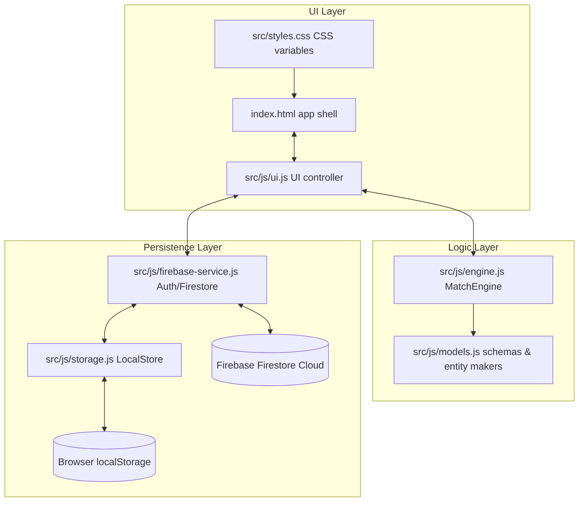

# 🏏 Gully Cricket Scorer

A high-fidelity, mobile-first web scoring application designed to handle the unique, highly configurable rules of gully cricket. The application features a clean, responsive Material-inspired UI with light/dark modes, full offline capability using browser `localStorage` as a fallback, and real-time syncing using the Firebase modular SDK (v10) when online.

This application is ported from a comprehensive terminal-based Python prototype (`Untitled-1.py`) into a lightweight, static client-side web application using vanilla HTML5, CSS3, and ES modules.

---

## 🗺️ Project Architecture & Data Flow

The project follows a modular, client-side MVC architecture using ES modules directly loaded in the browser. It does not require a compilation or build step (e.g., Webpack or Vite), keeping development frictionless.



### File Hierarchy & Roles

- **`index.html`**: The application shell providing layout structures for viewports, sidebars, interactive controls, and dialog modals.
- **`src/styles.css`**: CSS styling featuring a complete design token system (light & dark CSS color variables), responsive grid systems, cards, and modal systems optimized for mobile.
- **`src/js/app.js`**: App bootstrap file initialization. Handles theme defaults, loads the UI controller, and manages Firebase authentication state checks.
- **`src/js/ui.js`**: View controller that orchestrates rendering, inputs, viewports toggles (Dashboard, Teams, Players, Live Match, History, Settings), modal alerts, and interactive scorecards.
- **`src/js/engine.js`**: Core match scoring engine containing rules validation, outcome calculations, score parsing, batsman/bowler state adjustments, and undo/redo snapshots.
- **`src/js/models.js`**: Entity definitions, default configuration structures, and validator helpers for teams, players, matches, and outcomes.
- **`src/js/storage.js`**: Client-side storage layer (`LocalStore`) that manages local CRUD operations and seeds initial data (e.g., Street Kings vs Lane Legends) if empty.
- **`src/js/firebase-config.js`**: Configurations container for your Firebase web credentials.
- **`src/js/firebase-service.js`**: Adapter connecting local storage operations to Firebase Authentication and Firestore when online.
- **`Untitled-1.py`**: The original terminal-based OOP Python code serving as the reference model for the JavaScript match engine.

---

## ⚡ Gully Cricket Scoring Rules Engine

Gully cricket has rules that traditional cricket scoring tools cannot support. The `MatchEngine` handles these configuration flags:

### 1. Independent Innings Overs vs Bowler Spell Tracker
Traditional cricket trackers assume that an over has 6 balls and a bowler's spell corresponds directly to that over. Gully cricket decouples these:
* **Innings Over Slot (6 Legal Balls)**: Dictates the overall innings progress indicator (e.g., `1.3` overs) and triggers automatic strike rotation and over-boundary events.
* **Bowler Spell Deliveries (3 or 6 Balls)**: Dictates how many legal balls the selected bowler must bowl in their current spell.
  * **Baby Over**: 3 legal balls.
  * **Normal Over**: 6 legal balls.
  * **Spell Span Rule**: If a bowler selects a 6-ball spell but the innings over ends after 3 balls, the bowler continues their spell into the next innings over. The system handles this seamlessly without asking for a new bowler until the bowler's spell balls remaining hits `0`.

### 2. Configurable Settings Matrix
When initiating a new match in the **Match Setup Wizard**, you can configure:
* **Single Batting Mode**: Enabling this disables the non-striker. The striker remains at the crease and faces all balls until dismissed.
* **Last Man Standing**: If enabled and only one wicket remains, the last batsman is allowed to bat alone (the non-striker slot is removed).
* **Allow Consecutive Overs**: Restricts or allows a bowler to bowl consecutive spells back-to-back.
* **Bowler Over Limit**: Restricts the maximum legal balls a bowler can bowl throughout the entire innings (checked against `balls_already_bowled + proposed_spell <= limit`).
* **Extras & Byes toggles**: Enable or disable scoring adjustments for No-Balls (NB), Wide-Balls (WD), Byes (BYE), and Leg-Byes (LB).

### 3. Comprehensive Event Parser
The engine supports a large set of events:
* **Runs**: `0`, `1`, `2`, `3`, `4`, `6`
* **Extras**: `WD` (Wide), `NB` (No Ball), `WD+Runs`, `NB+Runs`, `BYE+Runs`, `LB+Runs`
* **Wickets & Run-Outs**: `W` (standard bowler wicket), `RO-S` (Striker Run-Out), `RO-NS` (Non-Striker Run-Out), `RETIRED` (retired batsman)
* **Match Control**: `ROTATE` (manual strike rotate), `DB` (Dead Ball), `UNDO` (reverts last ball state)

### 4. 20-State Undo Snapshot Stack
Every legal or illegal scoring event takes a deep-copy snapshot of the `match` state before performing operations. The scorer can execute `UNDO` up to 20 states back to fix scoring errors.

---

## 🗃️ Firestore Collections & Data Schemas

The application structure mirrors Firestore collections, which are synced automatically. Below is the data model used:

| Collection | Key Data Structure / Shape | Description |
| :--- | :--- | :--- |
| `users` | `{ id, authUid, displayName, email, createdAt }` | User registry profiles. |
| `teams` | `{ id, name, playerIds[], createdAt, updatedAt }` | Team names and rosters. |
| `players` | `{ id, name, mobile, email, createdAt, updatedAt }` | Reusable player registries. |
| `matches` | `{ id, teamAId, teamBId, settings, tossWinnerId, tossChoice, status, innings[], result }` | Core match metadata and status. |
| `innings` | `{ id, matchId, inningsNumber, battingTeamId, bowlingTeamId, target, scoreState }` | Detailed metrics per innings. |
| `overs` | `{ id, matchId, inningsId, overNumber, bowlerId, isBaby, legalBalls, runs, wickets }` | Bowler spell and over details. |
| `balls` | `{ id, matchId, inningsId, innings, ballNumber, overDisplay, batsman, bowler, event, runs, legalBall, timestamp }` | Ball-by-ball delivery log. |
| `scorecards`| `{ id, matchId, inningsId, battingRecords[], bowlingRecords[] }` | Compiled batting & bowling stats. |
| `settings` | `{ id, userId, theme, defaults }` | Individual user preferences. |

---

## 🚀 Running Locally

Because the application uses native **ES Modules** (`import` / `export`), double-clicking `index.html` to run via the `file://` protocol will result in CORS blocking. You must serve the project directory through a local web server.

### Option 1: Python (Easiest)
If you have Python installed, run this command in the project root:
```bash
python -m http.server 5173
```
Then open [http://localhost:5173](http://localhost:5173) in your browser.

### Option 2: Node.js (via serve)
If you have Node.js installed, run:
```bash
npx serve -l 5173
```
Then open [http://localhost:5173](http://localhost:5173) in your browser.

---

## ☁️ Firebase Deployment Checklist

To transition from browser `localStorage` persistence to the cloud database:

1. **Create Firebase Project**:
   * Navigate to the [Firebase Console](https://console.firebase.google.com/) and create a new project.
2. **Enable Auth Providers**:
   * Under **Authentication** -> **Sign-in method**, enable **Anonymous** and **Google** sign-in options.
3. **Initialize Firestore**:
   * Enable **Cloud Firestore** in production or test mode.
4. **Paste Configurations**:
   * Open `src/js/firebase-config.js` and input your web credentials:
     ```javascript
     export const firebaseConfig = {
       apiKey: "YOUR_API_KEY",
       authDomain: "YOUR_PROJECT_ID.firebaseapp.com",
       projectId: "YOUR_PROJECT_ID",
       storageBucket: "YOUR_PROJECT_ID.appspot.com",
       messagingSenderId: "YOUR_MESSAGING_SENDER_ID",
       appId: "YOUR_APP_ID"
     };
     ```
5. **Deploy to Hosting**:
   * Install Firebase tools:
     ```bash
     npm install -g firebase-tools
     ```
   * Login & initialize:
     ```bash
     firebase login
     ```
   * Set up and deploy:
     ```bash
     firebase deploy
     ```
